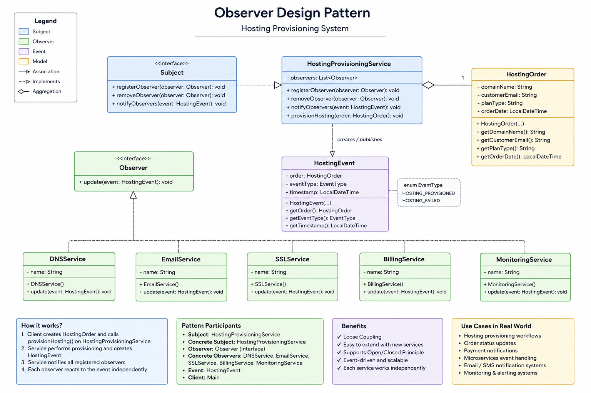

# Observer Design Pattern — Hosting Provisioning System

A real-world implementation of the **Observer Design Pattern** using a hosting provisioning workflow inspired by platforms like GoDaddy, Bluehost, and HostGator.

This project demonstrates how multiple independent services react automatically when a hosting account gets provisioned.

---

# 🚀 Problem Statement

Imagine a customer purchasing a hosting plan.

Once the hosting account is successfully created, multiple systems need to react:

- DNS configuration
- SSL certificate generation
- Welcome email notifications
- Billing & invoice generation
- Monitoring setup
- Analytics tracking

Instead of tightly coupling all these service calls together, we use the **Observer Design Pattern** to build a loosely coupled and extensible system.

---

# 🧠 What is Observer Design Pattern?

Observer Pattern is a **behavioral design pattern** where:

- One object (Subject) maintains a list of dependents (Observers)
- Whenever the subject changes state, all observers are automatically notified

It creates a **one-to-many relationship** between objects.

---

# 🌐 Real-World Industry Usage

This pattern is heavily used in:

- Hosting provisioning systems
- Event-driven architectures
- Kafka consumers
- Email notification systems
- Payment status updates
- Order management systems
- Microservices communication
- Webhook systems
- Monitoring & alerting systems

---

# 🏗️ Project Architecture

```text
Customer Purchases Hosting
              |
              v
HostingProvisioningService
              |
              | publishes event
              v
     HostingProvisionedEvent
       /      |       \
      /       |        \
   DNS      Email      SSL
 Service    Service   Service
```
 ---

# 🧩 Design Pattern Mapping

| Design Pattern Role | Project Class |
|---|---|
| Subject | HostingProvisioningService |
| Observer | DNSService, SSLService, EmailService |
| Event | HostingEvent |
| Client | Main |

---

# 📂 Project Structure

```text
src/
 ├── observer/
 │     ├── Observer.java
 │     ├── DNSService.java
 │     ├── EmailService.java
 │     ├── SSLService.java
 │     ├── BillingService.java
 │     └── MonitoringService.java
 │
 ├── subject/
 │     ├── Subject.java
 │     └── HostingProvisioningService.java
 │
 ├── event/
 │     └── HostingEvent.java
 │
 ├── model/
 │     └── HostingOrder.java
 │
 └── Main.java
 ```
 ---

# ⚙️ How It Works

## Step 1 - Customer Purchases Hosting

```java
HostingOrder order =
    new HostingOrder(
        "example.com",
        "customer@gmail.com"
    );
```
## Step 2 - Hosting Gets Provisioned

```java
provisioningService.provisionHosting(order);
```

## Step 3 - Event Gets Published

```java
notifyObservers(event);
```
## Step 4 — All Services React Independently

```java
observer.update(event);
```
Each subscribed service automatically reacts.

---
# 🏗️ Class Diagram


---
# 💻 Sample Output

```text
Provisioning hosting for domain: example.com

DNS Service: Configuring DNS for domain: example.com

Email Service: Sending welcome email to: customer@gmail.com

SSL Service: Generating SSL certificate for: example.com

Billing Service: Creating invoice for: example.com

Monitoring Service: Starting uptime monitoring for: example.com
```

# 🔥 Key Benefits of Observer Pattern

✅ Loose coupling

✅ Easy extensibility

✅ Better scalability

✅ Cleaner architecture

✅ Supports event-driven systems

✅ Easier maintenance

---

# ⚠️ Potential Drawbacks

- Too many observers may impact performance
- Harder debugging in deeply event-driven systems
- Failure handling becomes important in async systems

# 🚀 Future Improvements

Possible enterprise-level enhancements:

- Async observer execution using ExecutorService
- Kafka/RabbitMQ integration
- Retry mechanisms
- Failure isolation
- Spring Boot event publisher
- Distributed event-driven architecture


# 🧠 Key Learning

One of the biggest takeaways from this project:

> Instead of services directly calling each other,
> systems can communicate through events.

This is one of the foundational ideas behind modern backend architectures and microservices.


# ▶️ How to Run

## Clone Repository

```bash
git clone <repo-url>
```

---

## Navigate to Project

```bash
cd observer-pattern-hosting-system
```

---

## Run Main Class

Run:

```text
Main.java
```


# 📌 Tech Stack

- Java
- Object-Oriented Programming
- Observer Design Pattern

---

# 👨🏻‍💻 Author

Ashi Sahu

Exploring:
- Design Patterns
- System Design
- Backend Engineering
- Event-Driven Architecture
